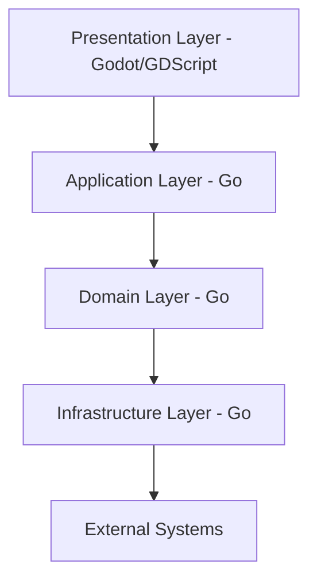

# 「マーチャントテイル」技術設計書（Design Document）

## 1. アーキテクチャ概要

### 1.1 技術スタック
- **ゲームエンジン**: Godot Engine 4.4.1
- **コア言語**: Go 1.23+（ゲームロジック）
- **バインディング**: GDExtension（Go-Godot連携）
- **UI/レンダリング**: GDScript（軽量処理のみ）
- **データ形式**: Protocol Buffers（セーブデータ）
- **ビルドツール**: Mage（Go）+ SCons（Godot）

### 1.2 アーキテクチャ原則
```
1. Clean Architecture準拠
2. Domain-Driven Design（DDD）
3. Event-Driven Architecture（EDA）
4. Data-Oriented Design（DOD）for performance
```

### 1.3 レイヤー構成



## 2. プロジェクト構造

```
merchant-tails/
├── godot/                      # Godotプロジェクト
│   ├── scenes/                 # シーンファイル
│   ├── scripts/                # GDScript（UIのみ）
│   ├── resources/              # アセット・リソース
│   └── project.godot           # プロジェクト設定
│
├── game/                       # Goゲームロジック
│   ├── cmd/                    # エントリーポイント
│   │   └── gdextension/        # GDExtension main
│   ├── internal/               # 内部パッケージ
│   │   ├── domain/             # ドメインモデル
│   │   │   ├── merchant/       # 商人システム
│   │   │   ├── market/         # 市場システム
│   │   │   ├── inventory/      # 在庫管理
│   │   │   └── event/          # イベントシステム
│   │   ├── application/        # アプリケーションサービス
│   │   │   ├── usecase/        # ユースケース
│   │   │   └── dto/            # データ転送オブジェクト
│   │   ├── infrastructure/     # インフラストラクチャ
│   │   │   ├── persistence/    # データ永続化
│   │   │   ├── gdextension/    # Godotバインディング
│   │   │   └── config/         # 設定管理
│   │   └── presentation/       # プレゼンテーション
│   │       └── api/            # GDExtension API
│   ├── pkg/                    # 公開パッケージ
│   │   ├── ecs/                # Entity Component System
│   │   ├── fsm/                # Finite State Machine
│   │   └── math/               # 数学ライブラリ
│   └── go.mod
│
├── proto/                      # Protocol Buffers定義
│   ├── save/                   # セーブデータ
│   └── config/                 # 設定データ
│
├── scripts/                    # ビルド・デプロイスクリプト
├── tests/                      # テストコード
└── docs/                       # ドキュメント
```

## 3. コアシステム設計

### 3.1 ゲームループアーキテクチャ

```go
// game/internal/domain/core/gameloop.go
type GameLoop interface {
    Initialize(ctx context.Context) error
    Update(deltaTime float64) error
    FixedUpdate() error  // 物理・ロジック更新（60FPS固定）
    LateUpdate() error   // レンダリング前の最終更新
    Shutdown() error
}

type GameState struct {
    CurrentPhase  GamePhase
    TimeManager   *TimeManager
    EventBus      *EventBus
    SystemManager *SystemManager
}
```

### 3.2 ECS（Entity Component System）設計

```go
// game/pkg/ecs/world.go
type World struct {
    entities   []Entity
    components map[ComponentType][]Component
    systems    []System
}

// 商品エンティティの例
type ItemEntity struct {
    ID          EntityID
    Components  []Component
}

// コンポーネント例
type PriceComponent struct {
    BasePrice    int
    CurrentPrice int
    Volatility   float32
}

type InventoryComponent struct {
    Quantity     int
    Location     InventoryLocation
    Condition    ItemCondition
}
```

### 3.3 イベントシステム

```go
// game/internal/domain/event/bus.go
type EventBus struct {
    subscribers map[EventType][]EventHandler
    queue       *PriorityQueue
    mu          sync.RWMutex
}

type Event interface {
    Type() EventType
    Timestamp() time.Time
    Priority() int
}

// イベント例
type MarketPriceChangeEvent struct {
    ItemID    string
    OldPrice  int
    NewPrice  int
    Reason    PriceChangeReason
}
```

## 4. ゲームシステム詳細設計

### 4.1 市場価格システム

```go
// game/internal/domain/market/pricing.go
type PricingEngine struct {
    baseFormula    PriceFormula
    modifiers      []PriceModifier
    volatilityCalc VolatilityCalculator
}

type PriceFormula interface {
    Calculate(item *Item, market *MarketState) float64
}

// 価格計算アルゴリズム
type DynamicPricingFormula struct {
    // 基本価格 = ベース価格 × (1 + 需給バランス × 変動係数)
    // 需給バランス = (需要 - 供給) / (需要 + 供給)
}
```

### 4.2 在庫管理システム

```go
// game/internal/domain/inventory/manager.go
type InventoryManager struct {
    storage     map[LocationID]*Storage
    strategies  map[ItemType]SellStrategy
    optimizer   *InventoryOptimizer
}

type SellStrategy interface {
    Decide(item *Item, market *MarketState) SellDecision
}

type SellDecision struct {
    Action    SellAction  // HOLD, SELL_NOW, SELL_MARKET
    Quantity  int
    TargetPrice int
}
```

### 4.3 AI商人システム

```go
// game/internal/domain/merchant/ai.go
type AIBehavior interface {
    DecideAction(state *GameState) MerchantAction
    UpdateStrategy(market *MarketState)
}

type MerchantPersonality struct {
    RiskTolerance float32  // 0.0-1.0
    Greediness    float32  // 0.0-1.0
    Information   float32  // 情報収集力
    Capital       int      // 資本力
}
```

## 5. データ構造

### 5.1 ゲーム状態

```protobuf
// proto/save/gamestate.proto
message GameState {
    message PlayerData {
        string id = 1;
        int32 gold = 2;
        int32 reputation = 3;
        repeated OwnedItem inventory = 4;
        ShopData shop = 5;
    }

    message MarketData {
        map<string, PriceHistory> prices = 1;
        repeated MarketEvent scheduled_events = 2;
    }

    PlayerData player = 1;
    MarketData market = 2;
    int32 current_day = 3;
    Season current_season = 4;
}
```

### 5.2 アイテムマスターデータ

```go
// game/internal/domain/item/master.go
type ItemMaster struct {
    ID           string
    Name         string
    Category     ItemCategory
    BasePrice    int
    Durability   int         // 腐敗までの日数
    Volatility   float32     // 価格変動率
    SeasonalMod  map[Season]float32
}

const (
    CategoryFruit      ItemCategory = "FRUIT"      // 短期投資型
    CategoryPotion     ItemCategory = "POTION"     // 成長株型
    CategoryWeapon     ItemCategory = "WEAPON"     // 安定株型
    CategoryAccessory  ItemCategory = "ACCESSORY"  // 投機型
    CategoryMagicBook  ItemCategory = "MAGIC_BOOK" // 債券型
    CategoryGem        ItemCategory = "GEM"        // ハイリスク型
)
```

## 6. GDExtension統合

### 6.1 バインディング設計

```go
// game/internal/infrastructure/gdextension/binding.go
package gdextension

// C++相当の関数をGoで実装
//export merchant_game_init
func merchant_game_init() *C.char {
    game := NewGameCore()
    return C.CString(game.GetInitStatus())
}

//export merchant_game_update
func merchant_game_update(delta C.double) {
    gameInstance.Update(float64(delta))
}

//export merchant_game_handle_input
func merchant_game_handle_input(input *C.char) {
    gameInstance.HandleInput(C.GoString(input))
}
```

### 6.2 Godot側の統合

```gdscript
# godot/scripts/GameController.gd
extends Node

var game_core: GDExtension

func _ready():
    game_core = preload("res://bin/merchant_game.gdextension")
    game_core.init()

func _process(delta):
    var state = game_core.update(delta)
    _update_ui(state)

func _on_buy_button_pressed(item_id: String):
    game_core.execute_action("buy", {"item_id": item_id})
```

## 7. パフォーマンス最適化

### 7.1 並行処理設計

```go
// game/internal/application/concurrent.go
type SystemScheduler struct {
    workers    int
    systemPool *WorkerPool
}

func (s *SystemScheduler) RunSystems(systems []System) {
    // 依存関係のないシステムを並列実行
    var wg sync.WaitGroup
    for _, sys := range systems {
        if !sys.HasDependencies() {
            wg.Add(1)
            go func(system System) {
                defer wg.Done()
                system.Update()
            }(sys)
        }
    }
    wg.Wait()
}
```

### 7.2 メモリ管理

```go
// Object Pooling
type ItemPool struct {
    pool sync.Pool
}

func (p *ItemPool) Get() *Item {
    if item := p.pool.Get(); item != nil {
        return item.(*Item)
    }
    return &Item{}
}

func (p *ItemPool) Put(item *Item) {
    item.Reset()
    p.pool.Put(item)
}
```

## 8. テスト戦略

### 8.1 テストレベル

```go
// tests/market_test.go
func TestPriceCalculation(t *testing.T) {
    market := NewMarketState()
    item := &Item{BasePrice: 100}

    // 需給バランステスト
    market.SetDemand(HIGH)
    market.SetSupply(LOW)

    price := market.CalculatePrice(item)
    assert.Greater(t, price, item.BasePrice)
}

// tests/integration_test.go
func TestFullGameCycle(t *testing.T) {
    game := NewGameCore()
    game.Initialize()

    // 1日のサイクルをシミュレート
    game.StartDay()
    game.ProcessMorningPhase()
    game.ProcessNoonPhase()
    game.ProcessNightPhase()

    assert.NotNil(t, game.GetDailySummary())
}
```

### 8.2 ベンチマーク

```go
func BenchmarkMarketUpdate(b *testing.B) {
    market := CreateMarketWith1000Items()
    b.ResetTimer()

    for i := 0; i < b.N; i++ {
        market.UpdatePrices()
    }
}
```

## 9. ビルド・デプロイ

### 9.1 ビルドパイプライン

```makefile
# Makefile
.PHONY: build

build-go:
	CGO_ENABLED=1 go build -buildmode=c-shared \
		-o godot/bin/merchant_game.so \
		game/cmd/gdextension/main.go

build-godot:
	godot --export "Windows Desktop" builds/windows/merchant_tails.exe
	godot --export "Linux/X11" builds/linux/merchant_tails
	godot --export "Mac OSX" builds/mac/merchant_tails.app

build-all: build-go build-godot

test:
	go test -v ./game/...
	godot --test
```

### 9.2 CI/CD設定

```yaml
# .github/workflows/build.yml
name: Build and Test

on: [push, pull_request]

jobs:
  build:
    runs-on: ubuntu-latest
    steps:
      - uses: actions/checkout@v3

      - name: Setup Go
        uses: actions/setup-go@v4
        with:
          go-version: '1.23'

      - name: Setup Godot
        uses: chickensoft-games/setup-godot@v1
        with:
          version: '4.4.1'

      - name: Build
        run: make build-all

      - name: Test
        run: make test
```

## 10. 開発ガイドライン

### 10.1 コーディング規約

```go
// BAD: 密結合
func UpdatePrice(item *Item) {
    item.Price = CalculateNewPrice() // 直接変更
}

// GOOD: 疎結合
func (m *Market) RequestPriceUpdate(itemID string) error {
    event := NewPriceUpdateEvent(itemID)
    return m.eventBus.Publish(event)
}
```

### 10.2 エラーハンドリング

```go
// カスタムエラー型
type GameError struct {
    Code    ErrorCode
    Message string
    Cause   error
}

func (e *GameError) Error() string {
    return fmt.Sprintf("[%s] %s", e.Code, e.Message)
}

// 使用例
func (m *Market) BuyItem(itemID string) error {
    item, err := m.findItem(itemID)
    if err != nil {
        return &GameError{
            Code:    ErrorItemNotFound,
            Message: "指定されたアイテムが見つかりません",
            Cause:   err,
        }
    }
    // ...
}
```

## 11. セキュリティ考慮事項

### 11.1 セーブデータ検証

```go
func ValidateSaveData(data []byte) error {
    // チェックサム検証
    if !verifyChecksum(data) {
        return ErrCorruptedSave
    }

    // 値の妥当性検証
    var save GameState
    if err := proto.Unmarshal(data, &save); err != nil {
        return err
    }

    if save.Player.Gold < 0 || save.Player.Gold > MaxGold {
        return ErrInvalidGoldAmount
    }

    return nil
}
```

## 12. 今後の拡張性

### 12.1 モジュラー設計

- プラグインシステムによるコンテンツ追加
- Mod対応（Godotのリソースパック機能利用）
- DLC用の追加システムインターフェース

### 12.2 マルチプラットフォーム対応

```go
// build tags for platform-specific code
// +build windows

package platform

func GetSaveDirectory() string {
    return os.Getenv("APPDATA") + "/MerchantTails"
}
```

## 13. 参考資料

- [Godot GDExtension Documentation](https://docs.godotengine.org/en/stable/tutorials/scripting/gdextension/)
- [Go-Godot Binding Examples](https://github.com/godot-go/godot-go)
- [Clean Architecture in Go](https://github.com/bxcodec/go-clean-arch)
- [Game Programming Patterns](https://gameprogrammingpatterns.com/)
